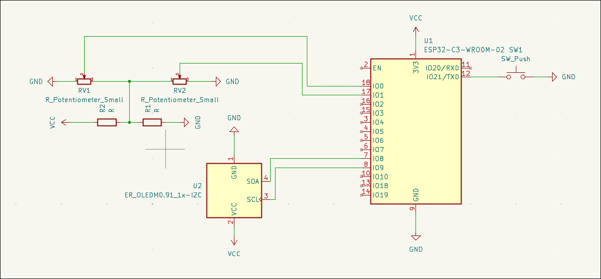

<p align="center">
  
</p>

<p align="center">
  
</p>

# Temp-calc

## A calculator that makes you wish to never use it again

Have you ever wished to make math more painful?
The day has come, introducing the Temp-calc,
a calculator you use temporarily,that pains you forever

## Mockup of the interface


## A very crude schematic



## BOM

| Part                | Qnt |
|-------------------- | ----|
| Potentiometer       | 2   |
| Resistor            | 2   |
| ssd1306 0.96" oled  | 1   |
| Push button         | 1   |
| esp32c3 super mini  | 1   |

## Flashing
```bash
cargo run --release
```
